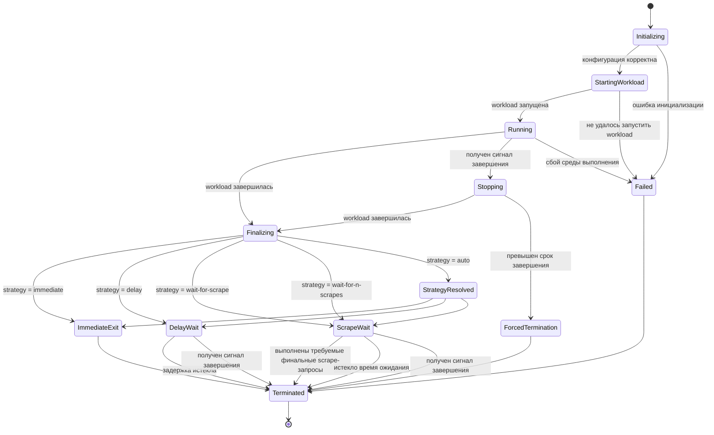

# Машина состояний среды выполнения

[English version](../../docs/04-specification/runtime-state-machine.md)

> Статус: ненормативная гипотеза о жизненном цикле
> Назначение: входные данные для архитектурного исследования

## Назначение

Этот документ определяет наблюдаемый жизненный цикл MetricShell в виде машины состояний.

Он описывает:

- состояния среды выполнения;
- внешние события;
- допустимые переходы;
- требуемые результаты;
- терминальные условия.

Он не предписывает:

- внутреннюю структуру пакетов;
- язык реализации;
- модель конкурентного выполнения;
- технологию хранения;
- библиотеку управления процессами;
- реализацию транспорта;
- HTTP-фреймворк.

Состояния и переходы в этом документе предварительные. По результатам архитектурного исследования состояния могут быть
объединены, разделены, переименованы или удалены при условии сохранения утверждённых функциональных требований и
критериев приёмки.

## Модель состояний

## Состояния

### Initializing

Runtime проверяет конфигурацию и подготавливает необходимые ресурсы.

Наблюдаемые требования:

- процесс workload ещё не запущен;
- `/metrics` может быть недоступна либо публиковать только метрики инициализации среды выполнения;
- некорректная конфигурация должна приводить к детерминированному завершению.

### StartingWorkload

Runtime пытается запустить настроенную workload.

Наблюдаемые требования:

- ошибку запуска необходимо отличать от сбоя workload;
- успешного кода завершения workload ещё не существует;
- время ожидания запуска, если оно настроено, должно быть ограничено.

### Running

Workload активна.

Наблюдаемые требования:

- метрики приложения принимаются через включённые интерфейсы приёма;
- `/metrics` публикует текущее наблюдаемое состояние метрик;
- сигналы завершения пересылаются согласно политике среды выполнения;
- runtime отслеживает завершение workload.

### Stopping

Runtime получила запрос на завершение, пока workload ещё активна.

Наблюдаемые требования:

- workload получает настроенный сигнал завершения;
- runtime ожидает лишь до настроенного предельного срока завершения;
- после истечения срока допускается принудительное завершение;
- ожидание финального scrape-запроса не должно отменять внешний запрос на завершение.

### Finalizing

Workload остановлена, и runtime подготавливает терминальное состояние метрик.

Наблюдаемые требования:

- результат завершения workload зафиксирован;
- последнее принятое состояние метрик финализировано;
- поколение финального снимка установлено;
- ни одна стратегия завершения ещё не выполнена.

### StrategyResolved

Runtime преобразует автоматическую стратегию в одну явную стратегию завершения.

Наблюдаемые требования:

- выбранная стратегия видна в журналах и метриках среды выполнения;
- одинаковые входные условия должны приводить к детерминированному поведению;
- автоматический выбор не должен вносить неограниченное ожидание.

### ImmediateExit

Runtime не ожидает после завершения workload.

Наблюдаемые требования:

- runtime завершается сразу после финализации;
- результат завершения workload сохраняется.

### DelayWait

Конечная точка финальных метрик остаётся доступной в течение настроенного времени.

Наблюдаемые требования:

- задержка ограничена;
- финальный snapshot остаётся неизменным;
- дополнительные scrape-запросы не продлевают задержку, если это явно не настроено;
- внешний запрос на завершение может досрочно прекратить ожидание.

### ScrapeWait

Конечная точка финальных метрик остаётся доступной, пока не произойдёт одно из событий:

- получено требуемое число допустимых scrape-запросов финального снимка;
- истекло настроенное время ожидания;
- внешний запрос на завершение прекратил ожидание.

Наблюдаемые требования:

- учитываются только scrape-запросы, обслуживающие поколение финального снимка;
- повторные запросы могут учитываться отдельно согласно политике;
- посторонние запросы проверки работоспособности не учитываются;
- ожидание всегда должно иметь тайм-аут.

### Failed

Runtime не может продолжать работу из-за внутреннего сбоя или ошибки инициализации.

Наблюдаемые требования:

- сбой должен быть записан в журнал;
- сбой среды выполнения нельзя представлять как успешное завершение workload;
- поведение при завершении должно быть детерминированным.

### ForcedTermination

Workload не остановилась до предельного срока завершения.

Наблюдаемые требования:

- принудительное завершение фиксируется;
- итоговый статус завершения среды выполнения должен соответствовать политике принудительного завершения;
- runtime не должна продолжать ожидать финальные scrape-запросы.

### Terminated

Runtime завершила все действия по остановке.

Наблюдаемые требования:

- последующие запросы метрик не обслуживаются;
- процесс возвращает итоговый статус завершения;
- дочерние процессы не остаются работающими.

## События

| Событие                     | Значение                                                          |
|-----------------------------|-------------------------------------------------------------------|
| `ConfigurationValidated`    | Конфигурация среды выполнения корректна.                          |
| `InitializationFailed`      | Необходимая инициализация среды выполнения завершилась с ошибкой. |
| `WorkloadStarted`           | Дочерний процесс workload успешно запущен.                        |
| `WorkloadStartFailed`       | Дочерний процесс workload запустить не удалось.                   |
| `WorkloadExited`            | Workload завершилась с некоторым результатом.                     |
| `TerminationRequested`      | Runtime получила внешний запрос на остановку.                     |
| `ShutdownDeadlineExceeded`  | Workload не завершилась до предельного срока.                     |
| `FinalSnapshotCreated`      | Поколение финальных метрик стало неизменяемым.                    |
| `DelayElapsed`              | Настроенная задержка после завершения истекла.                    |
| `EligibleScrapeObserved`    | Финальный snapshot отдан допустимому сборщику.                    |
| `RequiredScrapesObserved`   | Достигнуто настроенное пороговое число scrape-запросов.           |
| `FinalScrapeTimeoutElapsed` | Истекло время ожидания scrape-запросов.                           |
| `RuntimeFailure`            | Произошла неустранимая внутренняя ошибка среды выполнения.        |

## Правила переходов

1. Runtime не должна входить в `Running` до успешного запуска workload.
2. Runtime не должна входить в состояние ожидания после завершения до остановки workload.
3. Финальный snapshot должен быть создан до того, как можно учесть финальный scrape-запрос.
4. Внешнее завершение всегда имеет приоритет над ожиданием финального scrape-запроса.
5. Ни одно состояние ожидания не может быть неограниченным.
6. Runtime должна завершиться ровно один раз.
7. Результат завершения workload должен сохраняться, если политика сбоя среды выполнения или принудительного
   завершения явно не переопределяет его.
8. После завершения workload runtime не должна возвращаться в `Running`.
9. Финальные метрики должны оставаться неизменными в `DelayWait` и `ScrapeWait`.
10. Запросы проверки работоспособности и готовности нельзя считать финальными scrape-запросами метрик.

## Учёт финальных scrape-запросов

Scrape-запрос может учитываться при завершении работы, только если выполнены все настроенные условия допустимости.

Минимальные условия:

- запрос направлен к endpoint метрик;
- ответ содержит поколение финального снимка;
- ответ успешно передан полностью;
- запрос поступил после финализации.

Дополнительные условия могут включать:

- аутентификацию;
- список разрешённых источников;
- обязательный заголовок запроса;
- уникальный идентификатор сборщика;
- минимальный интервал между учитываемыми scrape-запросами.

Машина состояний не требует конкретной реализации проверки допустимости.

## Правила определения результата завершения

Терминальный результат определяется согласно следующему порядку приоритета:

1. неустранимый сбой среды выполнения;
2. принудительное завершение workload;
3. результат завершения workload;
4. успешное завершение среды выполнения.

Успешный scrape-запрос никогда не должен превращать результат сбойной workload в успешный.

Само по себе истечение времени ожидания финального scrape-запроса не должно менять результат workload, если это
явно не настроено.

## Внешнее завершение во время финального ожидания

При получении внешнего запроса на завершение в `DelayWait` или `ScrapeWait`:

1. runtime прекращает ожидание;
2. финальный snapshot может оставаться доступным лишь в течение ограниченного периода корректного завершения;
3. runtime завершается до внешнего предельного срока окружения;
4. исходный результат завершения workload по возможности сохраняется.

## Инварианты

Реализация должна поддерживать следующие инварианты:

- не более одной активной группы процессов workload;
- не более одного поколения финального снимка;
- один терминальный переход;
- отсутствие неограниченного ожидания;
- отсутствие неявной подмены кода завершения;
- неизменность финального снимка;
- отсутствие учтённых scrape-запросов до финализации.

## Ненормативные замечания по реализации

Машина состояний может быть реализована с помощью:

- явного цикла обработки событий;
- каналов;
- обработки сообщений в стиле акторов;
- синхронизированных переходов между состояниями;
- другой модели конкурентного выполнения.

Выбранная реализация не должна менять наблюдаемое поведение, определённое в этом документе.

## Открытые вопросы

Следующие вопросы намеренно оставлены нерешёнными:

- будет ли когда-либо поддерживаться многократный перезапуск workload;
- точные правила допустимости сборщика;
- будет ли сохранён автоматический выбор стратегии;
- учитываются ли финальные scrape-запросы глобально или отдельно для каждого сборщика;
- как назначаются коды завершения при сбое среды выполнения;
- сохраняет или заменяет код workload принудительное завершение.

---
[Поведенческая модель](behavioral-model-draft.md)

---
[README](README.md) | [README документации](../README.md)
