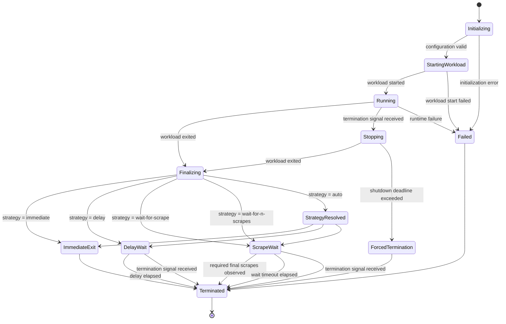

# Runtime State Machine

> Status: Non-normative lifecycle hypothesis
> Purpose: Input for architecture investigation

## Purpose

This document defines the observable lifecycle of MetricShell as a state machine.

It describes:

- runtime states;
- external events;
- valid transitions;
- required outcomes;
- terminal conditions.

It does not prescribe:

- internal package structure;
- implementation language;
- concurrency model;
- storage technology;
- process supervisor library;
- transport implementation;
- HTTP framework.

The states and transitions in this document are provisional.
Architecture investigation may merge, split, rename, or remove states while preserving approved functional requirements and acceptance criteria.

## State Model

## States

### Initializing

The runtime validates configuration and prepares required resources.

Observable requirements:

- no workload process has started;
- `/metrics` may be unavailable or expose runtime-only initialization metrics;
- invalid configuration must terminate deterministically.

### StartingWorkload

The runtime attempts to start the configured workload.

Observable requirements:

- startup failure must be distinguishable from workload failure;
- no successful workload exit code exists yet;
- startup timeout, when configured, must be bounded.

### Running

The workload is active.

Observable requirements:

- application metrics are accepted through enabled ingestion interfaces;
- `/metrics` exposes the current observable metric state;
- termination signals are forwarded according to runtime policy;
- the runtime tracks workload completion.

### Stopping

The runtime has received a termination request while the workload is still active.

Observable requirements:

- the workload receives the configured termination signal;
- the runtime waits only until the configured shutdown deadline;
- forced termination may occur after the deadline;
- final scrape waiting must not override an external termination request.

### Finalizing

The workload has stopped and the runtime prepares its terminal metric state.

Observable requirements:

- the workload exit result is captured;
- the last accepted metric state is finalized;
- the final snapshot generation is established;
- no shutdown strategy has completed yet.

### StrategyResolved

The runtime resolves an automatic strategy into one explicit shutdown strategy.

Observable requirements:

- the selected strategy is visible through logs and runtime metrics;
- the same input conditions must produce deterministic behavior;
- automatic resolution must not introduce unbounded waiting.

### ImmediateExit

The runtime performs no post-workload waiting.

Observable requirements:

- the runtime exits as soon as finalization is complete;
- the workload exit result is preserved.

### DelayWait

The final metrics endpoint remains available for a configured duration.

Observable requirements:

- the delay is bounded;
- the final snapshot remains stable;
- additional scrapes do not extend the delay unless explicitly configured;
- external termination may end the wait early.

### ScrapeWait

The final metrics endpoint remains available until either:

- the required number of eligible final snapshot scrapes is observed; or
- the configured timeout expires; or
- an external termination request ends the wait.

Observable requirements:

- only scrapes serving the final snapshot generation count;
- repeated requests may count separately according to policy;
- unrelated health requests must not count;
- waiting must always have a timeout.

### Failed

The runtime cannot continue because of an internal or initialization failure.

Observable requirements:

- failure must be logged;
- runtime failure must not be represented as successful workload completion;
- exit behavior must be deterministic.

### ForcedTermination

The workload did not stop before the shutdown deadline.

Observable requirements:

- forced termination is recorded;
- the final runtime exit status must reflect forced termination policy;
- the runtime must not continue waiting for final scrapes.

### Terminated

The runtime has completed all shutdown work.

Observable requirements:

- no further metrics requests are served;
- the final process exit status is emitted;
- child processes are not left running.

## Events

| Event                       | Meaning                                           |
|-----------------------------|---------------------------------------------------|
| `ConfigurationValidated`    | Runtime configuration is valid.                   |
| `InitializationFailed`      | Required runtime initialization failed.           |
| `WorkloadStarted`           | Child workload process started successfully.      |
| `WorkloadStartFailed`       | Child workload process could not be started.      |
| `WorkloadExited`            | Workload terminated with an exit result.          |
| `TerminationRequested`      | Runtime received an external stop request.        |
| `ShutdownDeadlineExceeded`  | Workload did not terminate before deadline.       |
| `FinalSnapshotCreated`      | Final metric generation became immutable.         |
| `DelayElapsed`              | Configured post-exit delay expired.               |
| `EligibleScrapeObserved`    | Final snapshot was served to an eligible scraper. |
| `RequiredScrapesObserved`   | Configured scrape threshold was reached.          |
| `FinalScrapeTimeoutElapsed` | Scrape waiting timeout expired.                   |
| `RuntimeFailure`            | Internal unrecoverable runtime error occurred.    |

## Transition Rules

1. The runtime must not enter `Running` before the workload starts successfully.
2. The runtime must not enter a post-workload waiting state before the workload exits.
3. A final snapshot must be established before a final scrape can count.
4. External termination always has precedence over final scrape waiting.
5. No waiting state may be unbounded.
6. The runtime must terminate exactly once.
7. The workload exit result must be preserved unless runtime failure or forced termination policy explicitly overrides
   it.
8. The runtime must not return to `Running` after the workload exits.
9. Final metrics must remain immutable during `DelayWait` and `ScrapeWait`.
10. Health and readiness requests must not be treated as final metric scrapes.

## Final Scrape Counting

A scrape may count toward shutdown only when all configured eligibility conditions are satisfied.

Minimum conditions:

- the request targets the metrics endpoint;
- the response contains the final snapshot generation;
- the response completes successfully;
- the request occurs after finalization.

Optional conditions may include:

- authentication;
- source allowlist;
- required request header;
- unique scraper identity;
- minimum interval between counted scrapes.

The state machine does not require a specific eligibility implementation.

## Exit Result Rules

The terminal result is derived from the following precedence:

1. unrecoverable runtime failure;
2. forced workload termination;
3. workload exit result;
4. successful runtime completion.

A successful scrape must never convert a failed workload result into success.

A final scrape timeout must not by itself change the workload exit result unless explicitly configured.

## External Termination During Final Wait

When an external termination request is received in `DelayWait` or `ScrapeWait`:

1. the runtime stops waiting;
2. the final snapshot may remain available only for a bounded shutdown grace period;
3. the runtime terminates before the environment's external deadline;
4. the original workload exit result is preserved where possible.

## Invariants

The implementation must maintain the following invariants:

- one active workload process group at most;
- one final snapshot generation at most;
- one terminal transition;
- no indefinite wait;
- no silent exit-code substitution;
- no mutable final snapshot;
- no counted scrape before finalization.

## Non-normative Implementation Notes

The state machine may be implemented using:

- an explicit event loop;
- channels;
- actor-style message processing;
- synchronized state transitions;
- another concurrency model.

The chosen implementation must not change the observable behavior defined in this document.

## Open Questions

The following items remain intentionally unresolved:

- whether multiple workload restarts are ever supported;
- exact scraper eligibility rules;
- whether automatic strategy resolution is retained;
- whether final scrape counting is global or scraper-specific;
- how runtime failure exit codes are assigned;
- whether forced termination preserves or replaces the workload exit code.

---
[Behavioral Model](behavioral-model-draft.md)

---
[Readme](README.md) | [Documentation Readme](../README.md)
